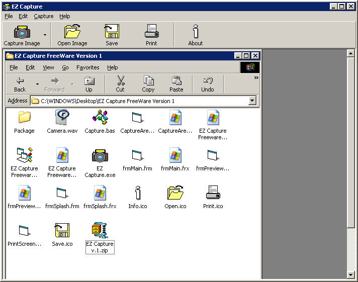



## EZ Capture \- Screen Capture tool

### Description

An easy to use screen capture tool. Based on Gary Choma's submission but simpler, smaller and different implementation. You can capture full screen, selected area and active window. Image can be copied to clipboard for pasting to other applications. Great for creating documentations.

An update is on the way with more features such as Image filter effects: Sharpen, Emboss, Diffuse, Solarize, Smoothen, etc. Image manipulation such as Invert, Zoomed, etc.

Automatic selection of window to capture.
 
### More Info
 
All image capturing is down using BitBlt api call for faster copying. Uses MDI to implement scrolling image without trial and error programming the scrollbar button. It doesn't uses picturebox instead create a bitmap and assign to form's picture properties which means fewer resources, compact and faster.

Tested on Win98SE WinXP Professional

The image capturing procedures is placed in a module which returns a bitmap

             |
---                |---
**Submitted On**   |2005-05-01 23:30:50
**By**             |[Donn C\. Romasanta](https://github.com/Planet-Source-Code/PSCIndex/blob/master/ByAuthor/donn-c-romasanta.md)
**Level**          |Intermediate
**User Rating**    |4.8 (53 globes from 11 users)
**Compatibility**  |VB 6\.0
**Category**       |[Windows API Call/ Explanation](https://github.com/Planet-Source-Code/PSCIndex/blob/master/ByCategory/windows-api-call-explanation__1-39.md)
**World**          |[Visual Basic](https://github.com/Planet-Source-Code/PSCIndex/blob/master/ByWorld/visual-basic.md)
**Archive File**   |[EZ\_Capture188597592005\.zip](https://github.com/Planet-Source-Code/donn-c-romasanta-ez-capture-screen-capture-tool__1-55227/archive/master.zip)

